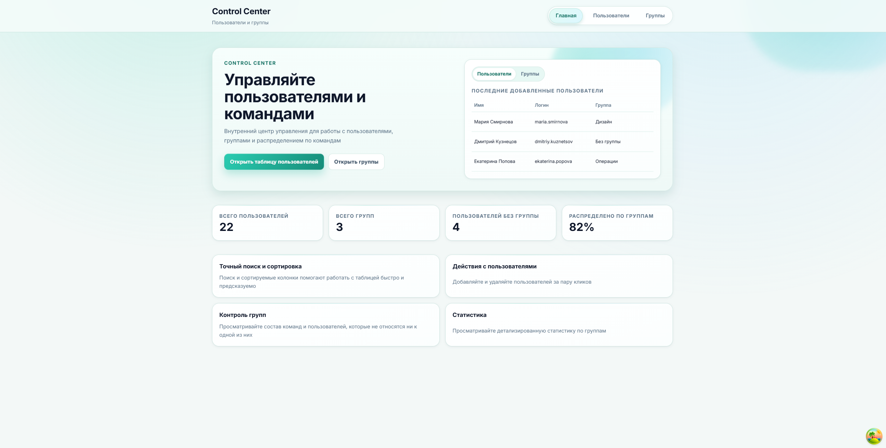
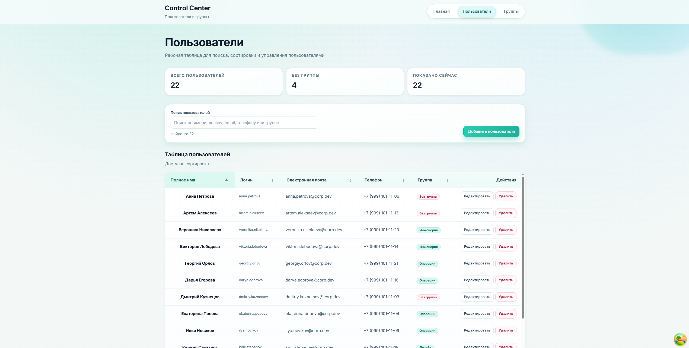
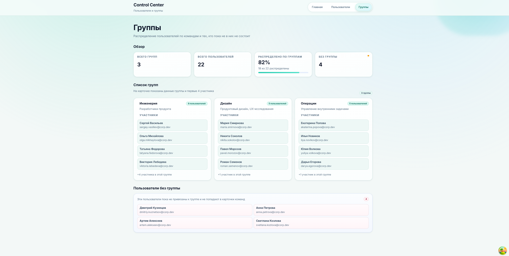

# Control Center

Control Center - тестовый frontend-проект на React + TypeScript для управления пользователями и просмотра групп в формате внутренней админ-панели.

## Краткое описание

Приложение содержит три маршрута (`/`, `/users`, `/groups`) и работает с mock API на `json-server`. Основной сценарий - 
работа с таблицей пользователей: поиск, сортировка, добавление, редактирование и удаление. 
Есть обзор групп и пользователей без группы.

## Стек технологий

- React 18
- TypeScript 5
- Vite 6
- React Router DOM 6
- TanStack Query 5
- CSS Modules
- json-server (mock backend)
- ESLint + Prettier

## Возможности приложения

- Главная страница с обзором состояния системы и превью данных.
- Страница пользователей в виде таблицы.
- Поиск пользователей по имени, логину, email, телефону и названию группы.
- Сортировка таблицы по колонкам.
- Добавление пользователя через модальное окно c валидацией формы.
- Редактирование пользователя.
- Удаление пользователя с confirm-диалогом.
- Страница групп со сводной статистикой и карточками команд.

## Структура страниц / routes

- `/` - WelcomePage: обзор, метрики, быстрые переходы.
- `/users` - UsersPage: таблица пользователей и CRUD-операции.
- `/groups` - GroupsPage: статистика и состав групп.

## Бизнес-логика

### Пользователи

- Данные загружаются через `useQuery` (`users`, `groups`).
- Поиск реализован с `useDebouncedValue(300ms)` + предсобранным индексом для фильтрации.
- Сортировка контролируется в state (`key`, `direction`) и применяется после фильтрации.
- `create/update/delete` выполняются через `useMutation`; после мутаций инвалидируется кэш `users`.
- Форма пользователя валидирует имя, логин, email и телефон до отправки.

### Группы

- Пользователи агрегируются по `groupId`.
- Показываются карточки групп и отдельный блок пользователей без группы.
- В сводке считаются total groups / total users / coverage / unassigned.

## Локальный запуск

### 0) Окружение

```bash
cp .env.example .env
```

### 1) Установка

```bash
npm install
```

### 2) Запуск frontend

```bash
npm run dev
```

Frontend: `http://localhost:5173`

### 3) Запуск mock backend

```bash
npm run server
```

Mock API: `http://localhost:3001`

### 4) Запуск с помощью docker (может ругаться на package-lock.json)

```bash
docker compose up --build
```

## Данные и mock backend 

Источник данных: `mock/db.json`.

HTTP-база настраивается через `VITE_API_BASE_URL` (по умолчанию `http://localhost:3001`).

### Frontend намеренно не меняет файловое хранилище, поэтому после перезапуска данные будут снова из файла.

## Архитектурные решения

- `src/app` - bootstrap, router, providers.
- `src/pages` - route-level страницы.
- `src/components/ui` - переиспользуемые UI-компоненты.
- `src/components/users`, `src/components/groups`, `src/components/common` - feature-компоненты.
- `src/api` - слой запросов и адаптеры API.
- `src/lib` - функции бизнес-логики.
- `src/shared/localization` - русская локализация и функции словоформ.
- `src/styles` - глобальные токены и базовые стили.

Ключевой принцип: UI-компоненты отделены от бизнес-утилит, а серверное состояние централизовано через TanStack Query.

## Скриншоты приложения







## Выводы по проектированию UI вручную и при помощи LLM

### Что дало ручное проектирование UI

Основной плюс ручной работы проявился в тех местах, где была важна настройка пользовательского сценария.
Страница пользователей - это в первую очередь функциональная страница, поэтому интерфейс должен быть удобным,
что сложно объяснить модели.

Инструменты работы с таблицей можно воспринять по-разному в плане удобства, с этим ручная разработка справится лучше,
так как разработчик лучше представляет пользовательский путь, чем модель.

### Что дало использование LLM

LLM оказался полезным как инструмент для быстрого прохода по базовым этапам разработки. С его помощью было проще:
- быстро собрать базовую архитектуру интерфейса;
- предложить несколько вариантов структуры;
- ускорить полировку отдельных блоков;
- быстрее пройти путь от базовой панели к конечной концепции.

Относительно шаблонные вещи LLM делает гораздо быстрее, чем при ручной разработке, а качество остается на том же уровне.
Также модель может быстро поменять что-то на всей странице. Например, я захотел поменять цветовую гамму и использовал LLM,
чтобы не подбирать цвета вручную для всем компонентов.

Использовал я Codex, который соединяется с github репозиторием и видит весь проект целиком. Это удобно при диагностике проблем, 
а также помогает привести проект к единому стилю, при использовании модели.

### Что пришлось дорабатывать вручную после LLM

Практика показала, что сгенерированный результат никогда не стоит принимать без проверки. 
После LLM-итераций в проекте приходилось вручную:
- упрощать или убирать лишние подписи;
- выравнивать отступы и иерархию между блоками;
- исправлять локализацию и русские формулировки;
- стабилизировать высоту и поведение интерактивных блоков;
- наводить порядок в стилях, локализации и структуре компонентов, кодстайле.

Буду честен, у меня не получилось сделать с помощью модели конечный вид страницы, доработки в любом случае были.

LLM хорошо ускоряет старт и помогает с начальной фазой решения задачи, 
но итоговое качество решения и кода все равно зависит от ручной доработки.

### Главный вывод

Самым эффективным я считаю смешанный подход:

LLM использую для быстрого старта, поиска направления решения, первичной сборки экранов и ускорения рутинной части. 
Затем вручную дорабатываю элемент до финального вида, а также правлю код под кодстайл и понятную архитектуру проекта.